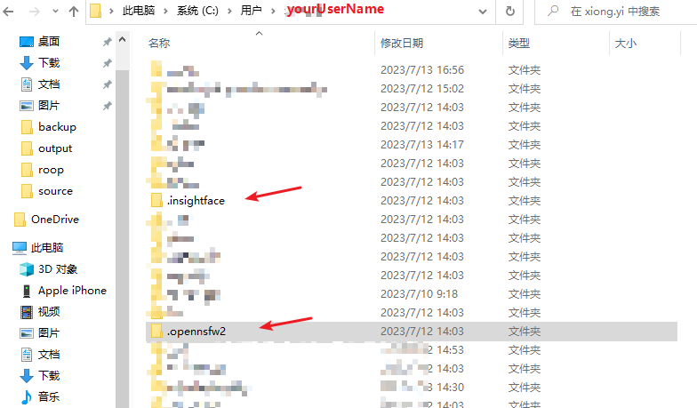
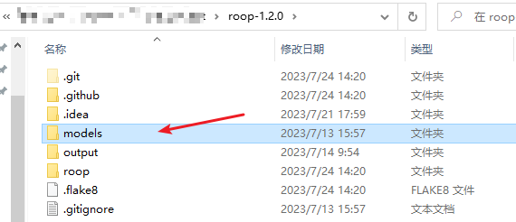

# roop 一键换脸（1.2.0）
> roop 一键换脸，只需要一张惊天脸的图片就可以实现视频和图片换脸，不需要设置和单独训练；基于deepinsight的insightface 模型实现，结合ffmpeg 实现对视频的处理，GFPGAN v1.4 增强脸部后输出，支持cli 和UI操作，另外有stable_diffusion 版本，支持CPU和GPU 两种模式，CPU 可以玩玩小图，跑大图和长视频费时费力;

[roop仓库地址](https://github.com/s0md3v/roop)


## 实现过程简述
假设我们将`图片A`的脸换到`图片/视频 B`内；(后面我们以A\B简称)

### 替换图片流程
- 利用[insightface](https://github.com/deepinsight/insightface) 分析`A`和`B`图片内的脸。
- 利用模型进行替换脸的操作(这里只管他提供的模型，其他大家可以不关心。)
- GFPGAN v1.4 锐化增强脸部
- 输出结果

### 视频替换流程
- 视频流程其实就是把视频利用ffmpeg 拆成单帧，然后逐帧按替换图片的流程处理，最后又利用ffmpeg 返回输出视频

### 其他功能点
- 注意留意项目内的issues 和文档，有些社区提供能功能在fork版本上

### 特别注意点
- 注意画面内最好不要有多张脸，特别是A
- 效果不是特别好，只能说当个玩具玩玩可以，特别是 发型差别大的，在秃头上面特别明显
- 侧脸场景 基本就没用了，这里涉及面部3d 和2d的问题，不作深究，感兴趣的可以搜搜；


## 本地化(windows)

### 基础环境安装
[基础环境介绍和基础软件下载](../基础环境/基础环境.md)

>roop 需要的软件如下 请按需安装
- python3.10.x
- ffmpeg
- cuda 118 安装

>roop/模型下载
- [roop 1.2.0和相关模型 百度网盘下载](https://pan.baidu.com/s/19SJ6qkOYkkkMLDATVtfjUg?pwd=acyd)


### 安装
本文针对1.2.0版本，后续版本可能会有部分差异

#### 模型安装
- 依赖模型安装
将下载下来的roop包内的usermodules 内的两个文件夹`.opennsfw2` `.insightface`，直接复制到`C:\Users\yourUserName`目录下

>不要去动文件夹结构和文件夹名！！！！



- 主模型下载
将下载下来的roop包内的models 文件夹直接复制到 roop-1.2.0 文件夹内



- 安装pip
> 提前设置 pip 代理或者镜像 参考 [基础环境介绍和基础软件下载](../基础环境/基础环境.md)
```shell
 pip install -r requirements.txt
```
## 使用UI界面运行

- 安装完成后在`roop-1.2.0`的文件下打开命令行工具


- 启动UI界面,等待界面启动


> UI 界面提供一键操作,参数已经是调优符合大部分场景。如需其他更多功能可以使用CLI方式,社区也有把功能都放出来自定义的UI 版本

## 使用命令行 运行

```shell
python run.py -s SOURCE_PATH -t TARGET_PATH -o OUTPUT_PATH #...other options
```
## 命令参考
```options
options:
  -h, --help                                               展示帮助信息后退出
  -s SOURCE_PATH, --source SOURCE_PATH                     source图片路径 可以是相对路径也可以是绝对路径
  -t TARGET_PATH, --target TARGET_PATH                     target图片/视频路径 可以是相对路径也可以是绝对路径
  -o OUTPUT_PATH, --output OUTPUT_PATH                     保存文件的完整路径，必须包含文件名，图片建议使用jpg格式 视频使用MP4
  --frame-processor FRAME_PROCESSOR [FRAME_PROCESSOR ...]  针对单张图的脸部处理器，可以是多个,默认值 face_swapper[换脸],face_enhancer[加强脸部锐化效果]
  --keep-fps                                               保持target视频fps值，默认值 False
  --keep-frames                                            保留视频拆帧的缓存图片，默认值False
  --skip-audio                                             生成视频不保留音频，默认值False
  --many-faces                                             是否处理单张图里面的多个脸，默认只更换一个脸，且随机
  --reference-face-position REFERENCE_FACE_POSITION        以target 里面的一帧脸部位置来确认替换的脸，已编号0开始
  --reference-frame-number REFERENCE_FRAME_NUMBER          以target 里面截图作为参考，只替换target 里面的这张脸，（暂未实现）
  --similar-face-distance SIMILAR_FACE_DISTANCE            单张人脸视频如果出现部分替换效果不理想的情况可以调节此值，默认值0.85，
  --video-encoder {libx264,libx265,libvpx-vp9}             输出视频编码器选择 默认libx264 可选lib265,libvpx-vp9 
  --video-quality [0-51]                                   输出视频质量 默认值18，可选值0-51
  --max-memory MAX_MEMORY                                  roop运行时最大允许使用的内存,单位GB,默认值未限制，这里在CPU场景下是内存，GPU 场景下是CPU的显存大小，设置需要注意自己内存/显存大小不要超过限制
  --execution-provider {cpu} [{cpu} ...]                   处理方式选择, 默认值 cpu,cuda:N卡,rocm:AMD（linux ）,dml:widnows下DirectML，coreml:mac,openvino:intel 
  --execution-threads EXECUTION_THREADS                    允许多少个线程来处理程序，取决于系统，不能设置
  -v, --version                                            展示版本信息后退出
```

## 使用谷歌colab  云服务体验
需要谷歌帐号，需要魔法梯子，优势免费18GB GPU，不需要本地麻烦的安装过程。
roop-colab :https://github.com/k186/roop-colab

