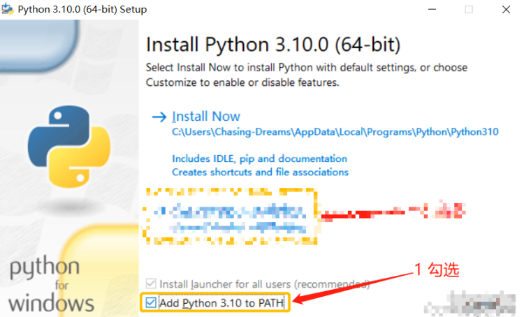
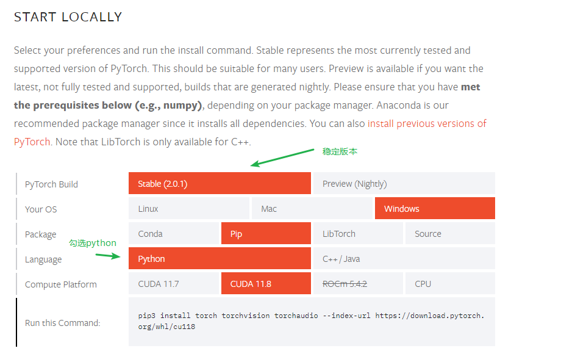
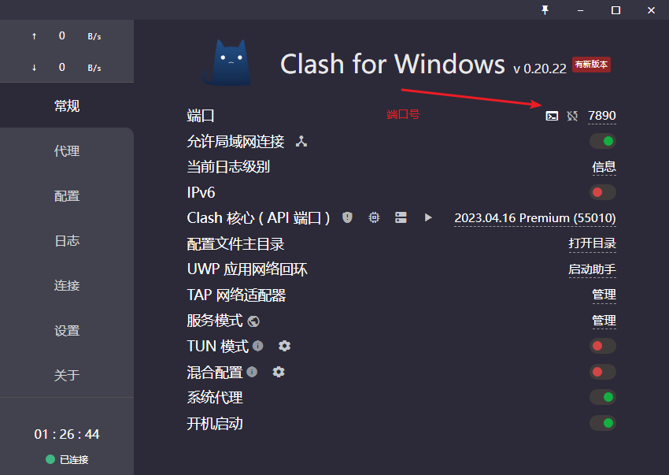

# 基础环境
[toc]
>roop,deep face,face swap,swap face,stable diffusion,DFL,DFLAB,colab

本文介绍关于常用本地化AI工具的基础环境搭建介绍，集合了目前作者使用的AI工具本地化所需硬件和软件环境
只针对windows 10+N卡环境介绍
## 硬件环境
- CPU
    - i5-13600KF 以上
- 内存
    - DDR4  32GB起
- 显卡
    - GTX1080 8GB以上
    - RTX3090 8GB以上
    - 不支持40系列N卡
- 硬盘
    - 数据盘 2TB SSD NVMe PCIe 4.0（建议GM7000）
    - 系统盘 1TB SSD NVMe PCIe 4.0（建议西数SN850X）

## 软件环境

>[百度网盘](https://pan.baidu.com/s/1x0DNoze8OdZhJQMsfQmVAg?pwd=59bi )下载

涉及的软件大部分都在上面的网盘里,可以根据对应AI 要求 安装需要的

### 软件安装

-   Python 安装注意勾选

- Cuda 安装，提供的是 11.8版本

- Torch(可能需要设置Pip 镜像)
  - 通过pip 安装118 GPU 版本
  ```shell
    pip3 install torch torchvision torchaudio --index-url https://download.pytorch.org/whl/cu118
  ```
  - 自己选择安装适合的版本(https://pytorch.org/get-started/locally/)
  

## pip设置（永久设置）
部分地区可能会遇见pip下载没速度，或者直接报超时,不建议使用国内镜像,最好挂梯子,国内镜像有些不完整,有些又限速。反正最好自己先试试

### pip 下载走代理
- 设置代理
```shell
# 7890 为端口号，请查看自己的代理端口号
  set http_proxy=http://127.0.0.1:7890
  set https_proxy=https://127.0.0.1:7890 
```


- 取消代理
```shell
 set http_proxy=
 set https_proxy=
```
### pip 设置国内常用镜像

- 通过命令设置
```shell
# 腾讯源
pip config set global.index-url https://mirrors.cloud.tencent.com/pypi/simple

```


